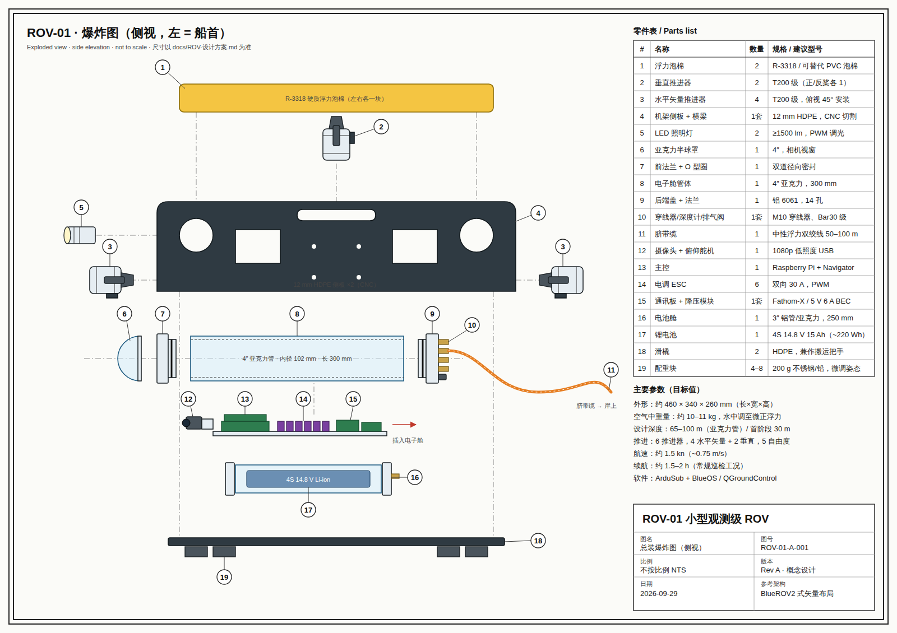
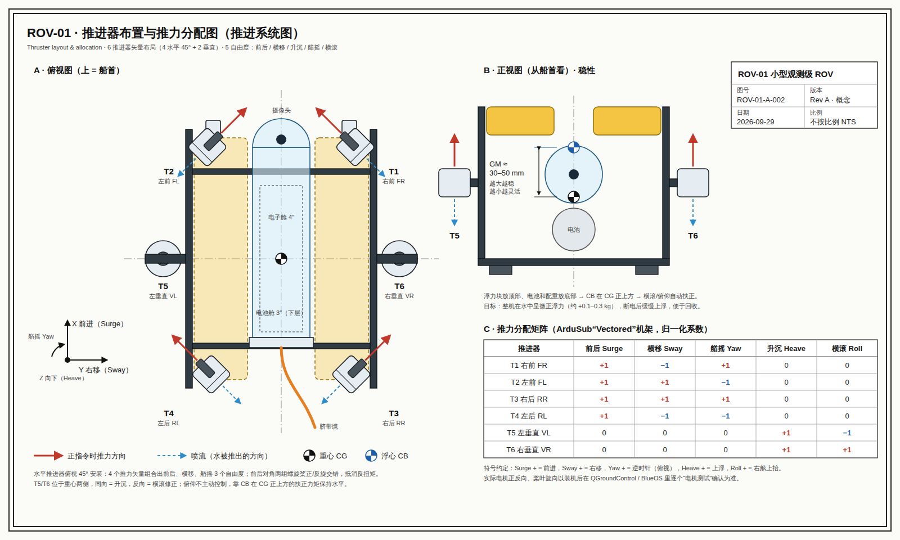

# ROV-01 自制小型观测级 ROV

- 设计方案（路线图 / 技术难点 / 成本）：[docs/ROV-设计方案.md](docs/ROV-设计方案.md)
- 图纸
  - A-001 总装爆炸图：[SVG](drawings/rov-exploded.svg) · [PNG](drawings/rov-exploded.png)
  - A-002 推进器布置与推力分配图：[SVG](drawings/rov-thrusters.svg) · [PNG](drawings/rov-thrusters.png)

