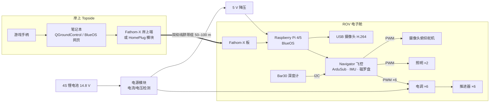

# ROV-01 自制小型观测级 ROV —— 设计方案（Rev A 概念稿）

> 目标：自己做一台能下 30 m（设计余量 100 m）、有线遥控、带高清视频的观测级 ROV。
> 架构参考 BlueROV2 的"6 推进器矢量布局 + ArduSub 开源飞控"，把成熟的开源方案当骨架，
> 把精力花在机械结构、水密和整机调试上。

图纸：

| 图号 | 内容 | 文件 |
|---|---|---|
| ROV-01-A-001 | 总装爆炸图（侧视）+ 零件表 | [`drawings/rov-exploded.svg`](../drawings/rov-exploded.svg) |
| ROV-01-A-002 | 推进器布置 / 稳性 / 推力分配矩阵 | [`drawings/rov-thrusters.svg`](../drawings/rov-thrusters.svg) |

---

## 1. 我们怎么做这件事（路线图）

建议分 5 个阶段，**每一阶段都要有"能验证的产出"**，不要一口气把整机装完再下水。

| 阶段 | 时间（业余） | 做什么 | 验收标准 |
|---|---|---|---|
| 0. 需求定义 | 1 周 | 定用途（观测/拍摄/打捞？）、最大深度、脐带长度、预算档 | 一页需求表，冻结关键参数 |
| 1. 桌面电子原型 | 2–3 周 | Pi + Navigator 刷 BlueOS/ArduSub，接 1 个推进器 + 摄像头，岸上电脑用 QGroundControl 控制 | 桌面上能用手柄转动推进器、看到低延迟视频 |
| 2. 水密舱验证 | 2–3 周 | 装配电子舱 + 电池舱，穿线器灌封，做**真空测试**，再空舱沉水桶/泳池 | 抽真空 −0.3 bar 保持 15 min 不掉压；泳池 2 m 放 1 h 无水 |
| 3. 整机集成 | 3–4 周 | 机架 CNC、装 6 推进器、配平浮力与重心、布线 | 泳池中微正浮力、静止时姿态水平、各自由度动作正确 |
| 4. 调参与开放水域 | 持续 | PID/定深/定向调参，逐步加深 5 → 15 → 30 m | 定深误差 < 10 cm；30 m 下潜回收无渗漏 |

**原则**
- **先抄成熟方案再改**：推进器、飞控、通讯、软件全用 Blue Robotics / ArduSub 生态，自己设计的只有机架和布局。等第一台跑起来，再考虑自制推进器或换便宜件。
- **每次只改一个变量**：尤其是水密件，改了就要重新做真空测试。
- **从浅到深**：水桶 → 泳池 → 码头边 → 开放水域。

### 系统架构

---

## 2. 技术难点（按风险排序）

### ① 水密与耐压 —— 最容易"一次毁掉整机"
- **静密封**：舱体两端用双道径向 O 型圈（不是端面压紧），O 型圈要上硅脂、槽和倒角尺寸按标准做，管口不能有划痕。
- **穿线器（penetrator）**：每根线一个，线缆和穿线器之间用环氧/聚氨酯灌封。**这是最常见的漏水点**，灌封前线缆外皮要打磨清洁。
- **真空测试**：每次开舱后都要用手动真空泵从排气阀抽到约 −0.3 bar（15 inHg），15 min 不掉压才下水。这一步必须养成习惯。
- **耐压**：4″ 亚克力管在厂商规格下约 65–100 m；更深要换铝管（阳极氧化）。圆顶是薄弱点，别让它撞到东西。

### ② 浮力、重心与稳性
- 整机调成**微正浮力**（断电会缓慢上浮，安全）。
- **浮心 CB 必须在重心 CG 正上方**（见 A-002 正视图），GM 约 30–50 mm：泡棉放顶部，电池和配重放底部。GM 太小会晃，太大则横滚修正费力。
- 只有 2 个垂直推进器，**俯仰不主动控制**，完全靠静稳性——所以配平做不好，镜头会一直点头。
- 实操：泳池里先不加电，用小配重块（19 号件）一点点调到水平、刚好浮在水面。

### ③ 推进与控制
- 6 推进器矢量布局：4 个水平推进器 45° 安装，得到前后、横移、艏摇；2 个垂直推进器负责升沉和横滚（见 A-002 推力分配矩阵）。
- ArduSub 已经内置这个 "Vectored" 机架的混控，**不需要自己写控制算法**；要做的是：确认每个电机的方向、正反桨安装正确，以及调定深/定向的 PID。
- 对角的推进器要用正/反桨交错，抵消反扭矩，否则会一直自转。

### ④ 脐带缆通讯
- 100 m 以内用一对双绞线 + 电力线载波（Fathom-X 或改装的 HomePlug AV 模块）即可跑约 10–80 Mbps，足够 1080p 视频。
- 脐带缆要**中性浮力**，否则会把 ROV 拽偏；还要有**抗拉件**（凯夫拉芯），别让拉力作用在穿线器上。
- 视频延迟目标 < 200 ms，否则很难操控。用 H.264 硬件编码摄像头，别用软件编码。

### ⑤ 电源与发热
- 6 个 T200 级推进器在 16 V 满载时每个可到约 20 A 以上，**全开能到 100 A 以上**。实际要在 ArduSub 里限功率（例如限制在 30–50%），否则电池、电调和线材都会顶不住。
- 电池放独立电池舱，和电子舱分开：安全、好换、降低舱内发热。
- 电子舱是密闭的，Pi 和电调发热只能靠舱壁导到水里；上岸在空气中长时间通电要注意过热。

### ⑥ 腐蚀与维护
- 海水使用：螺丝全用 316 不锈钢，铝件阳极氧化，不同金属之间做绝缘；每次下水后用淡水冲洗、推进器转一转排沙。

---

## 3. 成本估算

> 以下是 2026 年的市场价**粗估**（美元计价，按 1 USD ≈ 32 TWD / 7.1 CNY 换算），
> 下单前请以官网/淘宝实价为准。另外建议预留 **20–30% 试错预算**（烧掉的电调、重做的机架、漏水的穿线器……）。

### 方案 A：标准版（Blue Robotics 零件为主，目标 100 m）

| 项目 | 数量 | 单价 (USD) | 小计 (USD) |
|---|---|---|---|
| T200 推进器 | 6 | ~230 | ~1,380 |
| Basic ESC 电调 | 6 | ~40 | ~240 |
| Navigator 飞控 + Raspberry Pi 4/5 | 1 | ~250 + ~80 | ~330 |
| 4″ 水密舱（亚克力管 + 圆顶 + 法兰 + 端盖 + O 型圈） | 1 | ~350 | ~350 |
| 3″ 电池舱 | 1 | ~200 | ~200 |
| 锂电池 4S 15 Ah + 充电器 | 1 | ~350 | ~350 |
| 低照度 USB 摄像头 + 俯仰舵机 | 1 | ~140 | ~140 |
| LED 照明灯 | 2 | ~150 | ~300 |
| Bar30 深度计 | 1 | ~85 | ~85 |
| Fathom-X 通讯板（ROV 端 + 岸上端） | 1 套 | ~200 | ~200 |
| 中性浮力脐带缆 100 m | 1 | ~350 | ~350 |
| 穿线器、线材、排气阀、电源模块、接插件 | 1 批 | — | ~250 |
| HDPE 板材 CNC 加工 + 浮力泡棉 | 1 批 | — | ~300 |
| 手柄、真空测试泵、灌封胶、工具杂项 | 1 批 | — | ~200 |
| **合计** | | | **≈ 4,700 USD ≈ 15 万 TWD ≈ 3.3 万 CNY** |
| 含 25% 试错预算 | | | **≈ 5,900 USD ≈ 19 万 TWD ≈ 4.2 万 CNY** |

对照：直接买 BlueROV2 整机（含脐带缆和常用选配）通常在 7,000–9,000 USD 以上。自己做能省约 1/3，**但主要收获是完全掌握设计、之后能随意改**。

### 方案 B：入门省钱版（国产推进器 + 自制舱体，目标 30 m）

| 项目 | 小计 (USD) |
|---|---|
| 国产水下推进器（含电调）×6 | ~400–600 |
| Pixhawk 兼容飞控 + Raspberry Pi | ~150 |
| 自制亚克力/PVC 舱体 + 自车端盖 + O 型圈 | ~120 |
| 锂电池 4S + 充电器 | ~150 |
| 摄像头 + 照明 + MS5837 深度计 | ~120 |
| 网线脐带缆 50 m + HomePlug AV 模块改装 | ~100 |
| 机架板材、泡棉、线材、杂项 | ~200 |
| **合计** | **≈ 1,250–1,450 USD ≈ 4–4.6 万 TWD ≈ 0.9–1 万 CNY** |

方案 B 便宜，但国产推进器的品质不稳定，自制舱体的水密风险也高很多。**建议**：舱体、穿线器这类"一漏全毁"的件用成熟产品，推进器可以先用便宜的试，之后再升级。

---

## 4. 下一步待决定的事

1. 用途和作业水域：淡水/海水？最大深度？→ 决定舱体材料、脐带缆长度。
2. 预算档：方案 A、方案 B，还是混搭？
3. 有没有 CNC / 3D 打印 / 车床资源？→ 决定机架和端盖是自制还是外包。
4. 要不要机械手 / 声呐 / 定位等扩展？→ 如果要，现在就要在电源和端盖上预留穿线孔（目前端盖设计 14 孔，已预留）。
