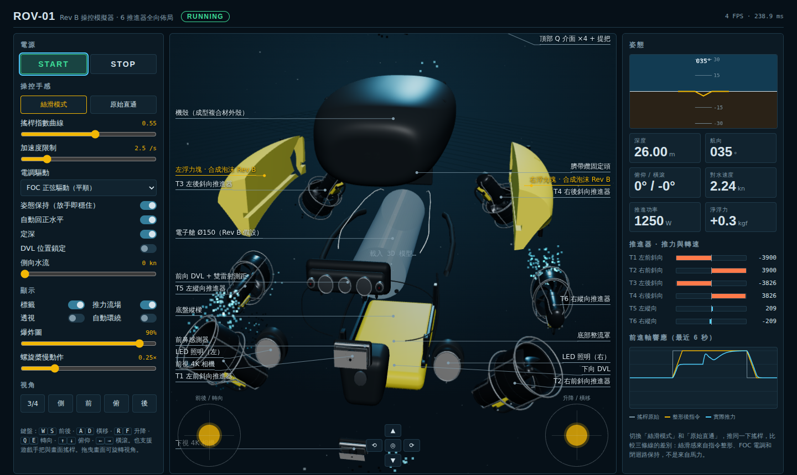

# 浮力材 Rev B：合成泡沫肩部浮力塊

以使用者提供的 X1 等級 Blender 重建模型為外形基準，把原本黃色側板（1–2 mm 薄皮）改成**實心合成泡沫浮力塊**。

| 檔案 | 內容 |
|---|---|
| [`cad/X1-buoyancy-revB.blend`](../cad/X1-buoyancy-revB.blend) | 完整模型＋新浮力塊（集合 `05 \| Buoyancy Rev B`）；舊黃色薄皮移到隱藏集合 `98` |
| [`cad/buoy_port_revB.stl`](../cad/buoy_port_revB.stl)、[`cad/buoy_stbd_revB.stl`](../cad/buoy_stbd_revB.stl) | 左右浮力塊，單位 mm，可直接給 CNC 廠報價 |
| [`cad/build_buoyancy_revB.py`](../cad/build_buoyancy_revB.py) | 產生浮力塊的 Blender 腳本（改參數即可重算） |
| [`sim/`](../sim/) | 互動 3D 操控模擬器（見下方） |

## 設計

- **位置**：機身左右上方肩部。浮力放高處，浮心在 z≈258 mm，高於推進器與 DVL 等重物，靜穩性好。
- **外形**：沿用機殼外表面，外凸 2 mm 作為塗層厚度；內側平面在 x = ±82 mm，與假設的 Ø150 電子艙保持 7 mm 間隙。
- **避讓**：6 個推進器各沿推力軸挖 Ø172 mm 圓柱避讓；底盤直立支架另外挖槽。
- **固定**：每塊 3 支 M8 316 不鏽鋼貫穿螺栓，外套 316 襯套（防止泡沫被壓潰），頂面沉頭 Ø18 × 14 mm；位置沿用原整流罩固定點。
- **走線**：內側 14 × 14 mm 走線槽，全長貫通。
- **配平**：底部每塊 2 個 60 × 44 × 25 mm 配重槽，可塞小泡沫塊或鉛粒微調前後、左右姿態。
- **表面**：1–2 mm 黃色聚脲（polyurea）或環氧塗層，防撞、防吸水，也保留原本黃色的辨識度。

## 數據（由模型直接計算）

| 項目 | 數值 |
|---|---|
| 單塊外形 | 101 × 580 × 185 mm |
| 體積 | 左 4.64 L＋右 4.64 L＝**9.29 L** |
| 設計密度 | 0.40 g/cc（350 m 級合成泡沫的常見範圍，需以供應商規格書為準） |
| 泡沫重量 | 3.7 kg |
| 海水中淨浮力 | **約 5.8 kgf** |

## 要注意：浮力不夠

X1 等級整機約 30 kg。泡沫以外的部分（電子艙、6 個推進器、DVL、相機、底盤）在水中的重量，我**粗估**約 8–10 kg（這是估計值，要等實際零件選定後秤重確認）。9.3 L 泡沫提供的 5.8 kgf 不足以讓整機中性浮力。

把浮力塊往下延伸到 z = 150 mm 只多了 0.08 L，因為機殼在 z = 176 mm 以下收窄，下方又有推進器和支架。**這個外形的肩部大約就只放得下 9.3 L**。可行的方向：

| 方案 | 做法 | 約可增加 |
|---|---|---|
| A | 電子艙縮小到 Ø130，浮力塊往內擴 | +1.7 L（約 +1.1 kgf） |
| B | 電子艙改薄壁鋁殼、降低艙內重量 | 減少 1–2 kg 水中重量 |
| C | 頂部加 20 mm 高的中央浮力蓋板（機身略增高） | +3 L 左右（約 +2 kgf） |
| D | 如果工作深度降到 100 m，改用 0.30 g/cc 泡沫 | 同體積淨浮力升到約 6.7 kgf |

實務上通常是 A＋B＋C 組合使用。

## 非中國來源（供參考，下單前須索取原產地證明 COO）

- **合成泡沫**：Trelleborg（瑞典，英美設廠）、Engineered Syntactic Systems（美國）、DeepWater Buoyancy（美國）、Balmoral（英國）
- **CNC 加工**：台灣（台中一帶）CNC 廠，直接用 STL 報價
- **316 螺栓與襯套**：台灣螺絲廠
- **塗層**：聚脲／環氧塗料選歐美日品牌，同樣要確認 COO

## 模擬器

[`sim/index.html`](../sim/index.html) 載入 [`sim/rov.glb`](../sim/rov.glb)（由 [`cad/export_sim_glb.py`](../cad/export_sim_glb.py) 從上述 .blend 匯出，已移除第三方品牌字樣）。本機用 `python3 -m http.server` 在 `sim/` 目錄開啟即可。

- 可拖曳的爆炸圖、標籤、推力流場、透視、五個視角
- 用模型裡 6 個推進器的實際位置與角度即時計算推力分配（6×6 矩陣）
- 「絲滑模式」與「原始直通」一鍵切換，右側前進軸響應圖可直接比較手感差異
- 姿態保持、自動回正、定深、DVL 位置鎖定、側向水流
